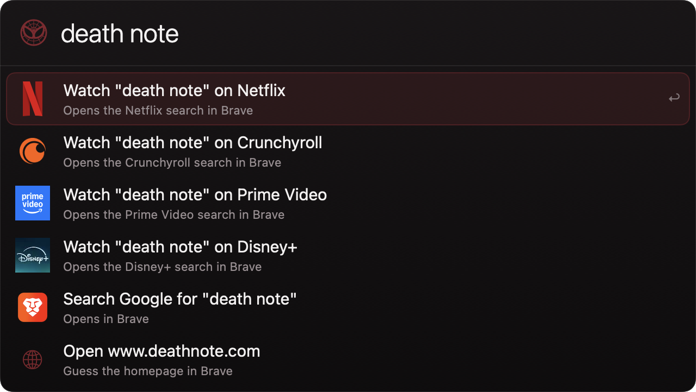
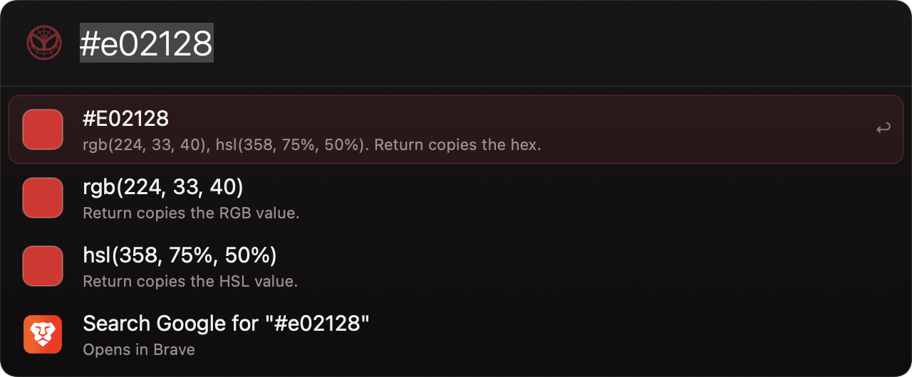
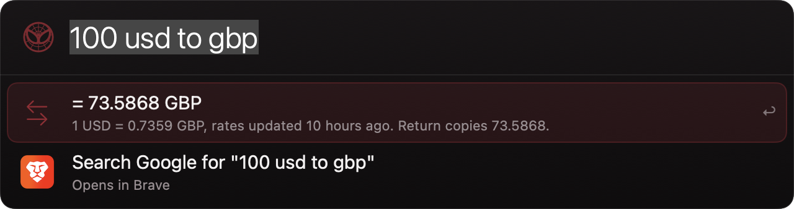

# Spidey

[](https://github.com/tptresh/sidekick/actions/workflows/ci.yml)
[](https://github.com/tptresh/sidekick/releases/latest)
[](LICENSE)


An open source, superhero-themed launcher for macOS, inspired by [Alfred](https://www.alfredapp.com/) and Spotlight. Press your hotkey, type, and go.

Native Swift + SwiftUI. No Electron, no dependencies, one small menu bar agent.

<p align="center">
  
</p>

<p align="center">
  
  
</p>

<p align="center">
  
</p>

## Features

- **App launcher**: fuzzy search across /Applications, /System/Applications, and ~/Applications
- **File search**: just type a file name and matching files appear alongside other results; Spotlight search of every indexed file merged with Spidey's own index of Documents, Downloads, and Desktop, ranked so exact and close name matches come first; multi-word queries work (`pitch deck` finds `Pitch Deck Final.pptx`); `find <name>` runs a files-only deep search with more results; Return opens, Cmd+Return reveals in Finder, results can be dragged out of the panel, and Cmd+Y Quick Looks the selected file (Space closes an open preview)
- **File content search**: `in <phrase>` searches inside file contents (Spotlight full-text), e.g. `in quarterly forecast`
- **Calculator**: type `2+2*5` and Return copies the result
- **Unit and currency conversion**: `100 usd to gbp`, `5km in miles`, `72f to c`. Exchange rates are fetched once a day and cached, so currency conversion works offline after the first fetch
- **World clock**: `time in tokyo` (or `tokyo time`) shows the current time, date, and offset from you.
  Every country works too (`time in ghana`), along with abbreviations (`time in hk`) and typos (`time in new dehli`)
- **Emoji search**: `emoji fire` and Return copies 🔥; searches names and keywords across a curated set
- **Color tools**: type `#E02128` or `rgb(224, 33, 40)` for a live swatch with hex, RGB, and HSL rows, each one Return-copies
- **Password generator**: `pw` or `pw 24` shows fresh random passwords (with and without symbols), Return copies one
- **Dictionary**: `define word` and `spell word`
- **Dev tools**: `uuid`, `b64 <text>` / `b64d <text>`, `url encode <text>` / `url decode <text>`, `sha256 <text>`, `md5 <text>`, and `ts` for unix-timestamp conversion (`ts`, `ts 1700000000`, `ts 2023-11-14T22:13:20Z`). Return copies the value
- **System info**: `ip` (local and public addresses), `battery`, `disk` free space. Return copies the value
- **Volume & brightness**: `volume 50`, `volume up` / `volume down`, `mute` / `unmute`; `brightness 0.8` and `brightness up|down` use the `brightness` CLI, which Sidekick installs automatically at launch via Homebrew
- **QR codes**: `qr <text>` shows a live preview; Return copies the PNG, Cmd+Return saves `qr.png` to the Desktop
- **Large type**: `large <text>` or `lt <text>` fills the screen with the text; any key or click dismisses it
- **System commands**: sleep, lock, restart, shut down, log out, empty trash, screen saver, eject (destructive ones ask for a confirming second Return)
- **Quit and force-kill**: `quit chrome` asks an app to quit; `kill chrome` force-quits it, and `kill node` also reaches background processes by name
- **Music controls**: `play`, `pause`, `play pause` (toggle), `next`/`skip`, `prev`/`back`, and `now playing` control whichever of Spotify or Music is running (one row per app if both are); `now playing` shows the current track and Return copies "track - artist"; with neither running, `play` offers to launch whichever is installed. First use triggers the standard macOS Automation prompt
- **Window snapping**: `left half`, `right half`, quarters, `maximize`, `minimize`, `center` move the front window, and `full screen` toggles real macOS full screen (one-time Accessibility permission; the row walks you through granting it)
- **Menu search**: `menu export` searches the front app's menu bar and runs the matching item (Accessibility permission)
- **Window switcher**: `win mail` lists on-screen windows across apps and raises the one you pick; strong title matches also appear on plain queries
- **Tab switcher**: `tab gmail` jumps to an open Brave (or Chrome) tab; first use shows the standard Automation consent
- **Toggles**: `dark mode`, `wifi`, `bluetooth` (via blueutil, which Sidekick installs automatically at launch), and `caffeinate` to keep the Mac awake until you turn it off
- **Scheduled appearance**: switches the Mac to Light Mode in the morning and Dark Mode in the evening (6:00 and 16:30 by default, editable in Settings)
- **Ping your Apple devices**: `ping my iphone`, `ping airpods`, or `find my keys` plays a sound on the device through the Find My app; any name from your Find My list works (`ping tanush's macbook`), with or without the apostrophe. A device type like `my iphone` picks your own device over a family member's. Uses the same one-time Accessibility permission as window snapping, and if a step cannot be automated Spidey says what went wrong and leaves Find My open on the device so finishing is one click
- **Timers**: `timer 10m tea` rings with a notification and a sound; `timers` lists running ones and Return cancels
- **Contacts**: type a first name (`claire`) and the person's usual actions appear - Message, Call, FaceTime, Email, and her card - with her photo on the card row; Cmd+Return copies the number or address instead of using it. `call claire`, `message claire`, `email claire`, `facetime claire` narrow the list to one way of reaching her, and cover her other numbers too. `contact claire` is the whole card: every number and address, FaceTime Audio, her address in Maps, her website, her birthday, and Return to open the card in Contacts (Cmd+Return copies the card as text). Searching also works by company, email address, or a run of digits from a number, and bare `contact` lists the people you reach for most. The address book is loaded into memory once and reloaded when it changes, so matching a bare first name costs nothing per keystroke; which action Spidey puts first is learned per person
- **Calendar**: `today`/`cal` lists today's remaining events, `next` shows the next event with minutes-until and location; Return opens Calendar
- **Reminders**: `remind me to buy milk at 5pm`, `remind standup in 20m`, `remind me to water plants tomorrow` create a Reminder with an alarm; the row previews exactly what will be created
- **Focus modes**: type `dnd` or `do not disturb` and Return to silence notifications; `dnd off` turns them back on. No setup: macOS only exposes Focus switching through Apple Shortcuts, so on first use Spidey generates the needed shortcut, signs it locally, and macOS shows a one-click "Add Shortcut" confirmation; the moment you add it, the Focus flips, and every later use is instant. Custom modes work by convention: name any shortcut `Focus: <Mode>` (a single "Set Focus" action, e.g. `Focus: Work`) and it appears as a command automatically
- **Web search keywords**: `google`, `amazon`, `wiki`, `imdb`, `gh`, `maps`. `amazon death note manga` opens the Amazon results directly
- **Custom search keywords**: define your own Alfred-style searches in `~/Library/Application Support/Spidey/searches.json` (`{"yt": {"name": "YouTube", "url": "https://www.youtube.com/results?search_query={query}"}}`, or the short form `{"ddg": "https://duckduckgo.com/?q={query}"}`). Then `yt lofi beats` opens the results directly. Type `searches` to create a commented example file
- **YouTube and media**: `youtube lofi beats` opens the YouTube search in Brave; bare `youtube`, `netflix`, or `crunchyroll` open the homepage in Brave
- **Show search**: type any show name and Spidey offers to open it on Netflix, Crunchyroll, Prime Video, or Disney+ (toggle each in Preferences)
- **Custom media sites**: add any streaming site's homepage URL in Preferences and show searches include it too (Spidey finds the show there with a site-scoped Google search). A background check runs every few days and flags sites that stop resolving
- **Last watched episode**: Spidey remembers where you got to in a show. `watching the pitt s1e6` saves it by hand; with an episode page open in Brave or Chrome, `watching` offers to save whatever it finds there (show, season, episode, and the exact page); and putting the Mac to sleep saves the open episode by itself, which is when people usually stop watching. Type the show's name later and "Resume The Pitt - Season 1, Episode 6" sits above the usual watch rows, with a "Next up" row for the following episode whenever the site's link spells the number out. `watching` on its own lists everything in progress, Return reopens one, and ⌘⏎ forgets it
- **Website directory**: type a mainstream site or brand name (`vinted`, `rimowa`, `grand seiko`, ...) and its homepage opens in Brave; unknown names get a homepage guess
- **Popularity-aware ranking**: typing a famous site or brand name (`best buy`, `cartier`) opens the website first; "Watch ... on Netflix" suggestions drop below it unless the query reads like a show title (or your usage history says otherwise). Curated offline, no network calls
- **Bookmarks**: searches your Brave/Chrome/Edge bookmarks (all profiles, de-duplicated). Strong matches appear alongside normal results; type `bm <query>` or `bookmark <query>` to search bookmarks only. Return opens the link, Cmd+Return copies the URL
- **Learned ranking**: Spidey remembers what you pick for a query and lifts those results toward the top next time, with recency-weighted frecency so old habits fade on their own (see the Learned ranking section below)
- **App aliases**: give apps your own shorthand (`ps` for Photoshop) via a small JSON file that reloads on save (see the App aliases section below)
- **Claude Code**: `claude fix the spelling issue on my web page` starts a Claude Code session with that prompt in your chosen folder, in the Claude desktop app when installed, otherwise in Terminal
- **Script commands (plugins)**: every executable file in `~/Library/Application Support/Spidey/scripts/` becomes a command named after its filename; type `scripts` to list them (see the Script commands section below)
- **Clipboard history**: everything you copy (text, files, images) is kept; type `clip` to browse and search it, Return copies an item back, ⌘⏎ pins an item so it stays at the top and never ages out of the history cap
- **Pasteboard tools**: `plain` (or `paste plain`) rewrites styled clipboard contents (RTF/HTML) as plain text so it pastes unformatted; `clear clipboard` empties the current clipboard (history is kept)
- **Snippets**: `snip add addr 123 Main Street` saves a canned-text snippet, `snip` lists them (Return copies one to the clipboard, Cmd+Return deletes it), `snip rm addr` deletes by keyword, and typing a snippet's keyword on its own surfaces it directly
- **Drag and drop**: drop files onto the panel to open them, reveal them, copy them, or copy their paths; dropped files are also recorded into clipboard history
- **Site logos**: web rows show the real favicon of the site (Netflix, Crunchyroll, Disney+, ...), fetched once and cached locally
- **Spider-Man theme**: black and deep red, with a Spidey mask emblem in the menu bar. Typing "spidey" plays a full screen entrance: the mask swings in on a web line

Everything that opens a website prefers [Brave](https://brave.com/); if Brave is not installed, your default browser is used.

## Install

### Download a build

Grab the latest `Sidekick.zip` from [Releases](https://github.com/tptresh/sidekick/releases/latest), unzip it, and move `Sidekick.app` to /Applications.

Builds are ad-hoc signed rather than notarized, so macOS quarantines the download and refuses to open it until you clear that flag once:

```
xattr -dr com.apple.quarantine /Applications/Sidekick.app
```

### Or build it yourself

Requires macOS 13+ and Xcode (or the Command Line Tools with a Swift 5.9+ toolchain).

```
git clone https://github.com/tptresh/sidekick.git
cd sidekick
make app
open build/Sidekick.app
```

Optional: copy `build/Sidekick.app` into /Applications and enable "Launch Spidey at login" in Preferences.

There is no menu bar window on first launch beyond the emblem: Sidekick is a background agent, so it lives in the menu bar and opens on the hotkey.

## The Cmd+Space hotkey

Spidey defaults to Cmd+Space, but macOS gives that key to Spotlight. To hand it to Spidey:

1. System Settings > Keyboard > Keyboard Shortcuts > Spotlight
2. Untick "Show Spotlight search"
3. Relaunch Spidey (or re-pick the hotkey in Preferences)

Until then, Spidey automatically falls back to Option+Space. You can record any other combo in Preferences from the menu bar icon.

## Menu bar panel

Click the emblem in the menu bar for a small panel in the style of Control
Center: today's weather where you are (from the free Open-Meteo forecast; the
last forecast is saved, so it shows instantly and refreshes in the background
every 30 minutes), a Keep Mac Awake switch, and the automatic Light and Dark
switch with its two times. While the Mac is being kept awake, the emblem itself
turns red in the menu bar.
Preferences and Quit are at the bottom.

Weather uses Core Location. If the Mac cannot give a fix (or access is denied)
and no city is typed in Preferences, Sidekick falls back to an approximate
location from your IP address via ipwho.is; no key or account is involved.

## Preferences

Click the emblem > Preferences. Everything is on one page, grouped like System
Settings:

- **Appearance**: the automatic Light and Dark schedule
- **Shortcut & Startup**: the hotkey that opens Spidey, and launch at login
- **Media Sites**: which streaming services and custom sites appear for show searches. Each has a health dot (green reachable, orange not responding, grey not checked), a summary line names any site that is down, plus Add Site and Check Now. Drag or right-click to reorder
- **Clipboard**: history size, keeping recent screenshots, and clearing history
- **Claude Code**: the folder sessions start in
- **Permissions**: what is allowed or installed, with buttons to ask again or retry an install

## Extending the website directory

Add your own sites without rebuilding: create `~/Library/Application Support/Spidey/sites.json` with name to URL pairs:

```json
{
  "my intranet": "https://intranet.example.com",
  "vinted": "https://www.vinted.fr"
}
```

User entries override the built-in list. To extend the built-in list for everyone, edit `Sources/Spidey/Providers/SiteDirectoryProvider.swift` and open a pull request.

## Script commands (plugins)

Spidey treats every **executable** file in
`~/Library/Application Support/Spidey/scripts/` as a command. The filename minus
its extension is the keyword: `weather.sh` becomes `weather`. Type
`scripts` to list everything Spidey discovered; if the folder does not exist yet,
that command offers to create it with a commented `hello.sh` example and reveals
it in Finder. Non-executable files are ignored (`chmod +x` to enable one), and
the folder is rescanned automatically whenever its contents change.

Typing `<keyword> [args...]` shows a single **Run** row. Because scripts can be
slow, nothing executes while you type; the script runs only when you press
Return. Arguments are split on spaces and passed as `argv` directly to the file
(never through a shell, so there is no quoting or injection to worry about; a
shebang line like `#!/bin/bash` or `#!/usr/bin/env python3` picks the
interpreter). The working directory is the scripts folder, the run is killed
after 10 seconds, and stdout is capped at 1 MB. Cmd+Return reveals the script in
Finder instead of running it.

When the script finishes, Spidey posts a notification and acts on the output:

1. **JSON mode**: if stdout parses as
   `{"items": [{"title": "...", "subtitle": "...", "arg": "...", "action": "copy"}]}`,
   the first item is acted on: `"action": "copy"` (the default) puts `arg` on the
   clipboard, `"action": "open"` opens `arg` as a URL or file path. `arg`
   defaults to the title. The notification summarizes the first item and how
   many more the script returned.
2. **Plain mode**: otherwise the full stdout is copied to the clipboard and the
   notification shows its first line.

A non-zero exit shows a failure notification with the first line of stderr; a
timeout says so.

Give a script a one-line description with a `spidey:` comment anywhere in its
first five lines (any comment leader works):

```bash
#!/bin/bash
# spidey: Copy the current public IP
curl -s https://api.ipify.org
```

The description appears as the subtitle of the Run row and in the `scripts`
list.

## Learned ranking

Spidey learns from what you pick. Every time you run a result, it remembers the
query you typed and the result you chose; next time, that result rises toward the
top, strongly for the same or a prefix of that query and mildly everywhere for
things you use a lot. Recency matters (Mozilla-style frecency: picks within the
hour count 4x, today 2x, this week 1x, older 0.5x), so old habits fade on their
own. History lives in `~/Library/Application Support/Spidey/usage.json`
(capped at 500 query associations + 500 global entries; least-recent pruned).
Delete the file to reset learning.

## App aliases

Create `~/Library/Application Support/Spidey/aliases.json` to give apps your own
shorthand:

```json
{
  "ps": "Photoshop",
  "vs": "Visual Studio Code"
}
```

When you type an alias (or start your query with it), the app it names is scored
as an exact match. The file is re-read automatically whenever it changes, no
restart needed.

## Permissions & setup

Sidekick front-loads its setup: on launch it asks for every permission its
features need and installs its own command line tools, so no feature surprises
you with a missing piece later. Preferences has a "Permissions & Tools" section
showing what is ready, with buttons to re-ask or retry an install.

- **At launch**: the app requests Accessibility, Contacts, Calendar, Reminders, and Location (for the weather in the menu bar panel) access up front, and triggers the standard Automation consents for System Events and Finder (plus Spotify/Music, Brave/Chrome, and Terminal when they are already running - apps that are not running are asked on first use instead, so launch never opens them).
- **Command line tools**: the Bluetooth toggle uses `blueutil` and brightness control uses the `brightness` CLI. If either is missing, Sidekick installs it through Homebrew in the background at launch and tells you when it is done. Without Homebrew installed, Sidekick explains that once and those two commands fall back to opening the matching System Settings pane.
- **Automation**: controlling System Events, Finder, music players, and browser tabs uses standard macOS Automation consents, the same ones every launcher triggers.
- **Contacts, Calendars, Reminders**: prompts need the bundled app (`make app`); a bare `swift build` binary has no Info.plist, so the result rows explain that instead of prompting. Without a signing certificate, `make app` ad-hoc signs and resets these grants (along with Accessibility) on every rebuild; run `make signing` once and they survive rebuilds instead (see CONTRIBUTING.md).
- **Files**: on first launch macOS asks for access to Documents, Downloads, and Desktop. Click Allow on each, or file search cannot see those folders (macOS also hides them from Spidey's Spotlight queries until then). Optionally grant Spidey Full Disk Access in System Settings > Privacy & Security for the widest Spotlight coverage.
- **Shortcuts**: Focus switching runs shortcuts through the `shortcuts` command line tool. The Do Not Disturb ones are generated by Spidey and confirmed by you with one click on first use; custom `Focus: <Mode>` ones you create yourself. No extra permission is needed.
- **Accessibility**: window snapping, menu search, the window switcher, and device pinging share one Accessibility permission; the result row walks you through granting it on first use. Pinging also triggers the standard Automation prompt for System Events, since it drives the Find My app by scripting its UI (macOS offers no other door into Find My).
- Spidey needs no accessibility permission for its hotkey.

## Development

```
swift build        # debug build
swift test         # unit tests
make app           # release .app bundle in build/ (main checkout only)
make prune         # delete .app bundles left behind in git worktrees
make icon          # regenerate Resources/AppIcon.icns
```

Only one Sidekick runs at a time: a launching copy terminates any older one, because two instances would each claim the menu bar item and the global hotkey. `make app` refuses to run in a git worktree for the same reason - a second bundle with the same bundle id is what lets macOS start a stale copy alongside the real app.

Dev flags: `Spidey --show "query"` opens the panel on launch; `Spidey --snapshot <dir>` renders sample panels to PNGs and exits.

## Theme

Sidekick wears a Spider-Man theme: black and deep red panels and a Spidey mask emblem in the menu bar. Type "spidey" to replay its full screen entrance.

## Contributing

Bug reports, fixes, new providers, and additions to the website directory are all welcome. Start with [CONTRIBUTING.md](CONTRIBUTING.md), which covers how the query engine and providers fit together and what the house rules are.

- [Report a bug](https://github.com/tptresh/sidekick/issues/new?template=bug_report.yml)
- [Request a feature](https://github.com/tptresh/sidekick/issues/new?template=feature_request.yml)
- [Report a security issue privately](SECURITY.md)
- [Code of conduct](CODE_OF_CONDUCT.md)

## Changelog

Every change that reaches the app is recorded in [SHIPLOG.md](SHIPLOG.md), newest at the bottom, with the commit it landed as. Tagged builds and their notes are on the [Releases](https://github.com/tptresh/sidekick/releases) page.

## Disclaimer

Spidey is a fan-made open source tool. It is not affiliated with, endorsed by, or connected to Marvel or any of the trademark holders whose characters inspired its themes.

## License

MIT. See [LICENSE](LICENSE).
